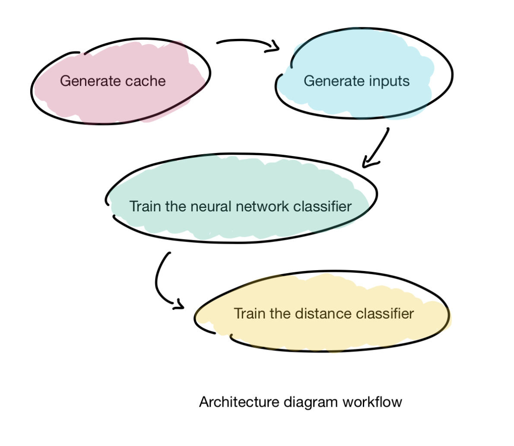
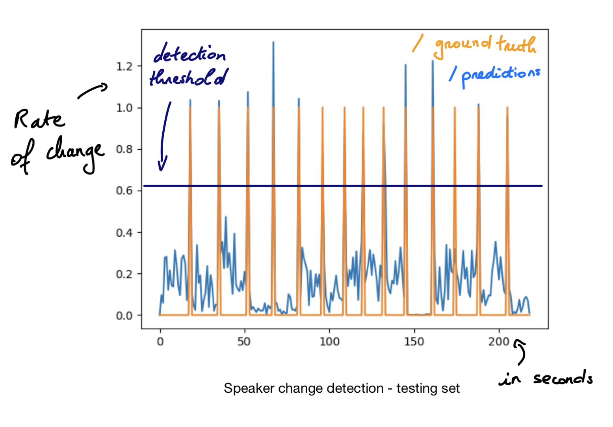

# Speaker Change Detection

Implementation of the paper: https://arxiv.org/abs/1702.02285

[](https://github.com/philipperemy/keras-attention-mechanism/blob/master/LICENSE) [](https://www.tensorflow.org/) [](https://keras.io/) 

_The mechanism proposed here is for real-time
speaker change detection in conversations, which firstly trains
a neural network text-independent speaker classifier using indomain
speaker data._


<p align="center">
  
</p>

<p align="center">
  
</p>


## Get Started

Because it takes a very long time to generate cache and inputs, I packaged them and uploaded them here:

- Cache uploaded at [cache-speaker-change-detection.zip](https://drive.google.com/open?id=1NRBBE7S1ecpbXQBfIyhY9O1DDNsBc0my)  (unzip it in `/tmp/`)
- [speaker-change-detection-data.pkl](https://drive.google.com/open?id=12gMYaV-ymQOtkYHCf9HxPurb9vB6dADK) (place it in `/tmp/`)
- [speaker-change-detection-norm.pkl](https://drive.google.com/open?id=1vykyS3bxKbkuhGtk36eTWfW9ZkqwJi6e) (place it in `/tmp/`)

You should have this:

- `/tmp/speaker-change-detection-data.pkl`
- `/tmp/speaker-change-detection-norm.pkl`
- `/tmp/speaker-change-detection/*.pkl`

The final plots are generated as `/tmp/distance_test_ID.png` where ID is the id of the plot.

Be careful you have enough space in `/tmp/` because you might run out of disk space there. If it's the case, you can modify all the `/tmp/` references inside the codebase to any folder of your choice.

Now run those commands to reproduce the results.

```
git clone git@github.com:philipperemy/speaker-change-detection.git
cd speaker-change-detection
virtualenv -p python3.6 venv # probably will work on every python3 impl.
source venv/bin/activate
pip install -r requirements.txt
# download the cache and all the files specified above (you can re-generate them yourself if you wish).

export PYTHONPATH=..:$PYTHONPATH; python 1_generate_inputs.py
export PYTHONPATH=..:$PYTHONPATH; python 2_train_classifier.py
export PYTHONPATH=..:$PYTHONPATH; python 3_train_distance_classifier.py
```
